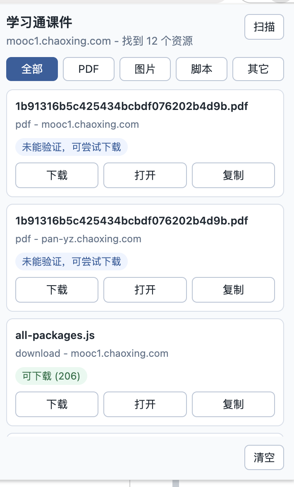

# 学习通课件下载助手

一个本地 Chrome / Edge 扩展，用来把学习通/超星课件页里已经返回给浏览器的 PDF 或下载链接找出来，省掉手动打开 DevTools、切到 Network、筛 Fetch/XHR、逐个找 `pdf:"..."` 的步骤。

## 能做什么

- 捕获学习通页面里的 `fetch` 和 `XMLHttpRequest` 响应。
- 自动提取 `pdf:"https://..."`、`.pdf`、`download`、`ananas` 等课件链接。
- 自动验证候选链接，把可下载资源排在前面，把 401/403 等不可用链接标出来；验证失败不会禁用下载按钮。
- 按 PDF、图片、脚本、其它分类筛选，PDF 会优先显示。
- 在扩展弹窗里显示找到的资源。
- 支持下载、打开、复制链接。

## 界面示例



## 限制

这个扩展只处理你当前 Chrome 登录态已经能访问、页面已经加载或允许请求的资源。它不会绕过登录、课程权限、付费限制、验证码、DRM 或服务端访问控制。

## 安装

### 下载代码

任选一种方式：

- 在 GitHub 页面点击 `Code` -> `Download ZIP`，解压到任意目录。
- 或者用 Git 克隆：

```bash
git clone https://github.com/dimaria1122/chaoxing_downloadpdf.git
```

### Chrome

1. 打开 Chrome。
2. 进入 `chrome://extensions/`。
3. 打开右上角“开发者模式”。
4. 点击“加载已解压的扩展程序”。
5. 选择本项目目录，也就是包含 `manifest.json` 的文件夹。

### Edge

1. 打开 Edge。
2. 进入 `edge://extensions/`。
3. 打开“开发人员模式”。
4. 点击“加载解压缩的扩展”。
5. 选择本项目目录，也就是包含 `manifest.json` 的文件夹。

不需要安装 Node.js，也不需要运行 `npm install`。`npm test` 只用于开发验证。

## 使用

1. 在 Chrome 中正常登录学习通/超星。
2. 打开课程的视频和课件所在页面。
3. 刷新页面，让课件相关的 Fetch/XHR 请求重新加载。
4. 点击 Chrome 工具栏里的扩展图标。
5. 如果列表里出现资源，点击“下载”。
6. 如果没有资源，点弹窗里的“扫描”，或者再次刷新课件页后打开弹窗。

弹窗里的分类：

- `PDF`：优先找课件 PDF。
- `图片`：课件页面或预览图资源。
- `脚本`：页面脚本，一般不需要下载。
- `其它`：无扩展名的下载候选或 Office 文档等。

## 工作原理

Chrome Manifest V3 扩展无法直接读取 `webRequest` 的响应体，所以本扩展把 `src/page-hook.js` 注入到页面主环境，拦截页面自己的 `fetch` 和 `XMLHttpRequest`，读取文本响应副本，再把发现的课件链接发给扩展后台保存。下载动作由 Chrome 的 `downloads` API 完成。

## 开发验证

```bash
npm test
node -e "JSON.parse(require('fs').readFileSync('manifest.json','utf8')); console.log('manifest ok')"
```
